# LTDC版本的室内控制面板程序

## 开发日志 2019/09/26

  ### 遇到问题：图片出现`雪花点`和`错位`  
  找资料时发现有人用LTDC和DMA2D显示图片时出现了问题 [博客地址](http://firebbs.cn/thread-26999-1-1.html)  
  主要是显示的图片前面有雪花点，并且显示的图片有错位。  
  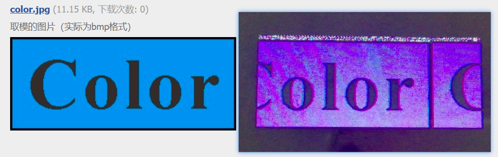  
    
  ### 雪花点的出现
  - 原因分析  
  LTDC的显存中被写入了“其他数据”，一些不是目标图片的数据。这些数据是其他语句在执行过程中所产生的（如变量、堆栈等等），它们并不是按照特定格式排列的（像素数据需要按RGB888、RGB565等格式排列）。  
  当这些数据被写到显存中的时候，LTDC将它看成颜色数据并显示出来，所以显示出来的是杂色雪花点（有颜色是因为该内存中的数据恰好三个字节连在一起组成了RGB颜色值，所以在显示屏中有显示颜色）

  ### 图片的错位显示
  仔细观察图片，会发现错位的图片中右边“C”上面的短黑线是比左边的长黑线要高一个像素的，这两条线**不是在同一行**。说明图片并不是单纯的将左半边的部分平移到右边来了而已（乍一看的话很容易产生这种错觉）。  
  而出现这种情况的原因，跟DMA2D的工作方式有关。  
  
  #### DMA2D
  DMA2D中关于图片的大小主要有三个关键的参数：
  ```
  DMA2D_InitStruct.DMA2D_PixelPerLine // 指定一行的像素数，即图片的宽度
  DMA2D_InitStruct.DMA2D_NumberOfLine // 指定行的数量，即图片的高度
  DMA2D_InitStruct.DMA2D_OutputOffset // 一行的末尾到下一行起始的偏移量，值为LCD的宽度减去图片的宽度
  ```
  其中，DMA2D_OutputOffset是比较难理解的。为什么需要这么一个参数？这跟像素数据的存储有关。像素数据是按照特定排列存储在显存里的，而内存都是按照顺序存储的，先是按序存储一行的数据，然后紧接着存储下一行的数据。  
  这就导致了与我们的固有观念产生了极大的冲突：在显示屏上相邻的像素点，在存储位置上并不一定相邻。
  
  > 例如：对于像素点p（x,y），与他相邻的像素点p1（x+1，y）和p2（x-1，y）在存储位置上是相邻的（因为在同一行）；但是相邻像素点p3（x，y+1）跟p不在同一行，它们在存储位置上相差了（`LCD_PIXEL_WIDTH - 1`）个距离。类比一下二维数组，更好理解。
  
  所以，画一条竖线，在内存中并不是像画横线一样操作了一片**连续的**的存储空间，而是操作了一个像素点便**跳转**（LCD_PIXEL_WIDTH - 1）个像素点去操作下一个像素点，各个“离散的”像素点在LCD屏幕有序地显示出来，最终组成了一条看起来“连续的”的竖线。  

  #### 导致错位的原因
  图片数据前面被“其他数据”占用了，导致图片数据的起始点不是原点！第一个像素点在某一行末尾的时候才被载入。由于DMA2D配置的是读取到一行图片的数据就换行（DMA2D_InitStruct.DMA2D_PixelPerLine），但是前面被“其他数据”占用了“一行图片”的一部分。虽然我们肉眼看起来图片没有读够一行，但是DMA2D认为它已经读够一行了，所以换行继续读取下一行的图片数据。  

  而第一行图片的数据已经被读取了一部分，这就导致DMA2D在读取第二行数据的时候，虽然我们肉眼看起来已经读完一行图片了，但是DMA2D没有读够“一行图片”长度的数据，于是他便继续读显存下一部分的数据，即第二行图片的前一部分（更好地说明了像素数据在显存中是一行一行连续存储的）。  

  如此重复多次，就出现了我们看到的“图片错位”的情况。  

  ### 归因：冗杂数据从何而来
  
  #### 试错：不断地踩坑
  一开始以为是LTDC、LTDC_Layer或DMA2D的存储空间没有配置好，导致“写入数据”的位置与“显示数据”的位置产生了偏差。以为是LTDC_Layer的显示区域往前挪，显示了“图片所在显存位置”之外的某些东西。但是查了很多配置，都没发现有什么问题。也改过内存位置，想将显示区域向后挪动，不显示前面的雪花点，结果都无功而返。  
  在写着这段文字的时候，我也才反应过来：根本不可能是显示区域错位的问题。我之所以会以为是显示错位的问题是因为我以为整个显示屏就那一小块显示图片的区域（图片在显示屏中间，其他地方都是黑的）。但实际上整个屏幕都在显示显存中的东西（其他区域也有数据，只不过是黑的而已，看起来就好像没数据一样！），所以不可能是显示区域错位的问题，要是错位的画其他黑色的地方也会错位，而不只是图片的那一小块区域。  

  #### 图片地址指向错误的可能
  既然不可能是图片显示错位，那么只可能是搬运了错误的数据到显存。  
  我一开始以为那一片雪花点是BMP图片的信息头，所以想着删掉图片数组的前一部分就能消掉雪花点了。但是我将图片数组的前一半都删掉了，前面雪花点区域的大小一点没变，而雪花点后面的图片倒是的确减少了一半，这让我百思不得其解 —— 这一部分雪花点究竟来源何处？

  #### 官方例程的对照
  最后，我在搜资料的时候发现原来ST官方的标准库例程中有关于利用DMA2D显示图片的（我当初咋不知道！！在网上找了好久才发现有一开头的那个博客！！）。  
  于是我将博客上的例程与官方的例程逐行进行对照，乍一看都没啥问题，差点崩溃。不过在第N次检查时发现了一些不一样的东西：  
  > 博客上的：
  ```
  const unsigned char gImage_color[27648];

  //...........

  LCD_DisplayPicture(100, 100, 300, 124,gImage_color);

  //............

  void LCD_DisplayPicture(uint16_t Xpos, uint16_t Ypos, uint16_t Width, uint16_t Height,const uint8_t *image){

    /* Configure Input Address */
    DMA2D_FG_InitStruct.DMA2D_FGMA = (uint32_t)*image;

  //...........
  }
  ```

  > 官方例程上的：
  ```
  const uint32_t ARGB4444_150x150[11250];
  
  //............

  static void DMA2D_Config(void){

    /* Configure Input Address */
    DMA2D_FG_InitStruct.DMA2D_FGMA = (uint32_t)&ARGB4444_150x150;

    //..........
  }
  ```

  经过对比，我发现对DMA2D_FGMA成员的操作，博客上用的给的图片数组的第一个成员，而官方例程给的是图片数组的地址。博客上的做法封装了一层函数，内聚性好，使用起来比较方便。

  书到用时方恨少，又开始后悔指针没有认真学。然后我写了个小的测试程序：
  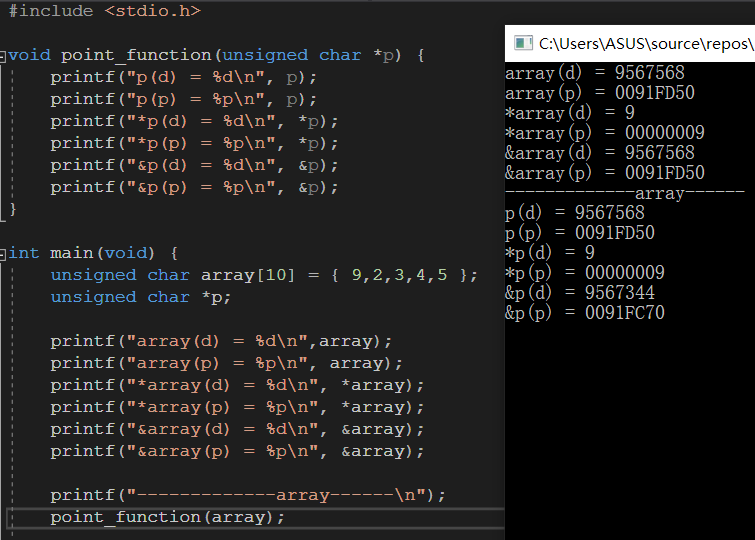

  结果发现是因为指向的地址不对- - 把其他地方的数据写到了显存中。  

  但是很奇怪，这两个地址居然**相差不多** 。要是相差很多的话就完全显示不出来图片了才对，这样我觉得反而更好排查。结果只差了一点，搞得我老是以为是图片错位、信息头之类的。服了。  

  将博客例程中的语句修改如下：
  ```
   DMA2D_FG_InitStruct.DMA2D_FGMA = (uint32_t)image;
  ```

  图片可以正常显示。  
  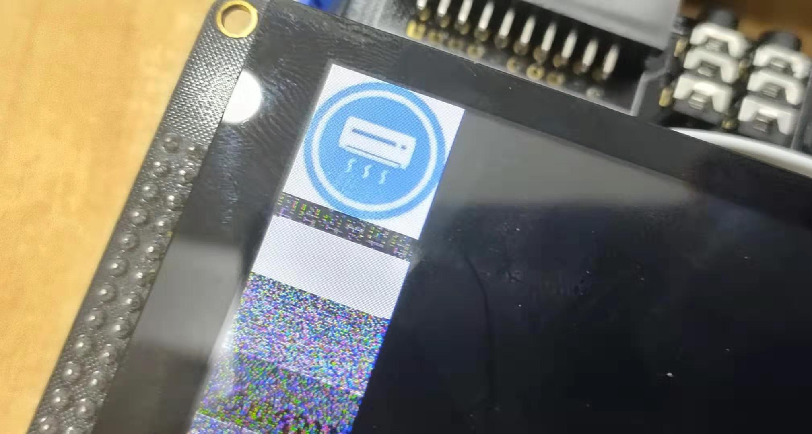  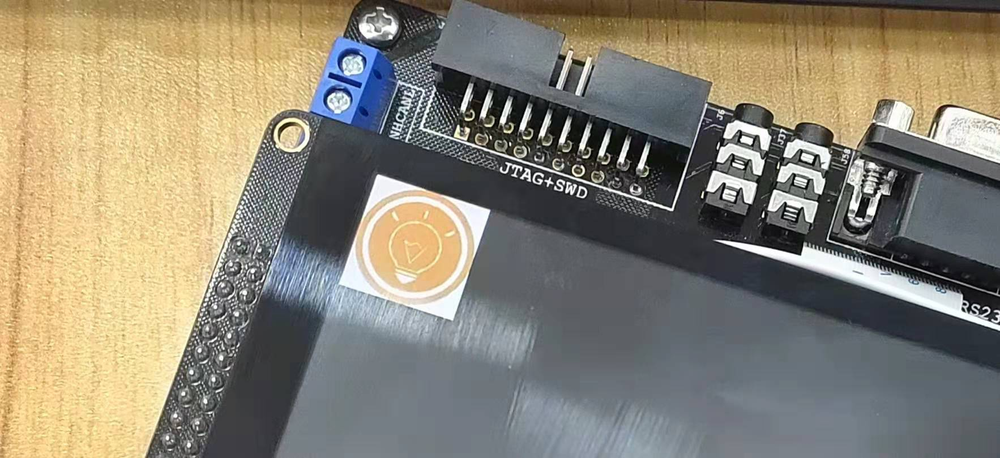

  ## 开发日志 2019/09/28

  ### 实现功能
  - **新增：** 触摸图标事件响应
  - **新增：** 编写用电器状态转换的宏
    - 采用`宏拼接`和`条件运算符`的方式实现用电器状态与用电器图标数组名的等价转换
    - 相较于传统的分支语句这种写法使得程序*更加简洁*，*可读性更好*
  - **改进：** 图标结构体增加*用电器类型*、*用电器状态*、*用电器编号*等成员
  - **改进：** 优化并精简触摸画板主程序
  - **改进：** 显示多个图标
  - **删除：** 触摸画板中关于笔刷、画刷的部分
  - **删除：** 触摸画板中关于触摸轨迹显示的部分  
  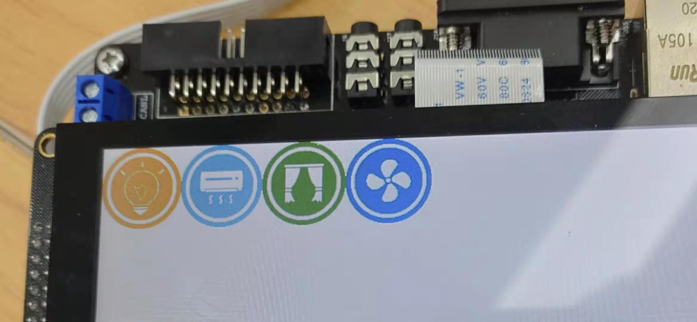
  ### 待完成
  - 字体的显示 
    - 大字体字模的制作
    - 文字的刷新（用空格清除原来的文字）
    - 文字空白范围与背景层的混合叠加
  - 前景层与背景层的叠加混合
    - ARGB8888格式的LCD_Layer的配置
    - 透明度混合因子的配置
  - 图片数组的生成
    - RLE编码格式的图片数组解码

  ### 今日总结

  #### 实用的宏展开
  之前编程的时候经常遇到这样的情况：
  - 只有0、1两种状态的分支语句
  - 两种表示同样东西的变量相互转换的麻烦
  eg：
  ```
  int i = 0;
  ...
  if( i == 0){
    ...
  } else if ( i == 1){
    ...
  }
  ```
  这种是比较蠢且无脑的写法，下面这种稍好一点：
  ```
  int i = 0;
  ...
  if( i ){
    ...
  } else {
    ...
  }
  ```
  后来我发现就两种情况的话还是条件表达式最方便：
  ```
  int i = 0;
  ...
  ( i ) ? {do something...} : { do another thing...}; 
  ```
  还有就是更加经常遇到的一种情况：
  ```
  #define LIGHT 1
  #define FAN   2
  ...
  int device = LIGHT; 
  int command_light[10];
  int command_fan[10];
  ...
  void do_command(int* command_device);
  ```
  device被改变时，传入do_command的command数组也要求改变。这是就遇到了很纠结的情况：  
  
  
  一种方法是分支判断后，每一个语句块都用不同的参数调用函数；  

  另一种是引入中间量，每个分支只是将不同的参数给中间量，然后在程序末以中间量作为参数调用函数；  
  
  这两种方法对函数来说比较友好，但是对于特殊的`执行语句`就不太方便了。以本项目为例：
  ```
  #define DEVICE_STATUS_TOGGLE(device, status) (status) ? (gImage_##device##_off) : (gImage_##device##_on)

  ...
  switch (ptr->device){
    case DEVICE_FAN:
        gImage = DEVICE_STATUS_TOGGLE(fan, ptr->status);
        break;
    case DEVICE_LIGHT:
        gImage = DEVICE_STATUS_TOGGLE(light, ptr->status);
        break;
    ...
  }
  ```
  如果不用宏展开的话还需要在每个case中多加一个判断，着实麻烦。

  #### 结构体与函数指针
  函数指针的引入让C拥有了类似“接口”一样的特性，使用起来很方便。  
  同时，在结构体中的函数指针能直接使用结构体中的成员。无需再给定额外的参数（也无法指定）。  
  对于参数很多的函数来说使用起来很方便。

  #### 灵感：图标图片数组作为成员
  在整理上述文档的时候，我发现之所以我需要不断地判断用电器类型、用电器状态，是因为各个变量是独立的，没有内聚性！  
  图标图片数组明明就应该是属于图标的一部分才对，根本没必要把它声明成外部数组，只需要在结构体中增加一个指针成员，然后在初始化图标结构体的时候将对应的数组首地址赋给指针就行了。这样在调用绘图函数的时候就不用再判断了，直接将这个指针作为参数调用绘图函数就行了。  
  然后我又想到绘图函数也没必要再封装一层了，直接将LCD_DisplayPicture()的内容放到绘图函数里面就行了，坐标什么的都是结构体里的成员，更加方便了。  
  但是这样又有一个问题，就是不同像素格式的时候切换起来会很麻烦。  

  #### 叹服：宏定义和预编译if的精妙
  如果没有宏定义的话，需要将一个变量声明成外部变量，并且每个用到的文件都要包含该头文件。  
  而如果不用预编译if直接用普通if来分支的话，程序每次执行都要有一个判断，但是对于`配置类`的设置来说，这个配置是在程序开始之前就设定好且在程序执行期间不会改动的。但是普通if仍需每次执行都要判断一次，这种地方多了的话不利于程序的高效运行。  
  使用预编译if的话就不会存在这种问题，在编译期间就将`不符合条件的语句块`给“删掉”了。在程序执行期间不会再次判断，提升了程序的执行效率。
  > 这种方法适用于`配置类`的语句块，特别是这种配置的语句穿插在`各个不同的文件`之中。


  ## 开发日志 2019/09/29

  ### 推翻：重写绘图函数的想法
  之前想过把LCD_DisplayPicture()的内容放到绘图函数Draw_Icon()里面去，可以减少封装的层数。  
  结果今天一试才发现这样子做反而不好。  
  主要是因为LCD_DisplayPicture()用到了较多的LCD相关的变量，而这些变量大部分是定义在*bsp_lcd.c*里面的。虽然可以将这些变量声明成外部变量同时让panel.c包含bsp_lcd.h来将LCD_DisplayPicture()的内容放到绘图函数中，但是这样做**增加了**程序的`耦合性`。  
  本来显示图片这种对操作DMA2D的东西就应该放在bsp_lcd.c中，这样程序的`内聚性`才高。如果把那些头文件、变量都包含进panel.c里去的话就会显得乱。负责某一部分的语句放成一个函数、负责某一块的变量、函数、宏放成一个.c和.h文件，这样才是最合理的设置啊。  
  虽然之前一直看着别人这么做，但是当自己需要在此基础上增添较多东西或者重写东西的时候就发现很难做好。做不到这么好的内聚和这么低的耦合。其实主要还是对高内聚和低耦合的认知还是不够，没有真正地融入进编程的潜意识中，这着实是需要提高的。   

## 开发日志 2019/10/02

- 新增：利用字模放大函数显示字符串
- 新增：PANEL_DEBUG宏
  - 利用可变参数、__LINE__宏、字符串拼接等实现对printf函数的封装，增加了开发效率

### 遇到问题
#### 显示字符之后无法操作图标
- 显示字符的函数放在按钮初始化函数之后的话点击触摸屏无反应，之前则可以。  
   
- 触摸屏的debug信息有正常输出，说明是上层执行函数出了问题  

- 显示字符函数放在图标初始化后点击对应区域**没有进入到** 图标区域判断的if语句中去，相关代码如下：  
```
/**
 * @brief Touch_Icon_Up 图标被释放时调用的函数，由触摸屏调用
 * 
 * @param x 触摸最后释放时的x坐标
 * @param y 触摸最后释放时的y坐标
 */
void Touch_Icon_Up(uint16_t x, uint16_t y){
    uint8_t i;
	
    PANEL_DEBUG("Funtion Touch_Icon_Up");
	
    for (i = 0; i < ICON_NUM; i++){
        /* 触笔在图标区域释放 */
        if (x <= (icon[i].start_x + ICON_SIZE) && y <= (icon[i].start_y + ICON_SIZE) && y >= icon[i].start_y && x >= icon[i].start_x){
        
            icon[i].touch_flag = 0; /*释放触摸标志*/

            icon[i].status = (icon[i].status == 0) ? 1 : 0; /* 反转用电器状态 */
            
            PANEL_DEBUG("Redraw the icon above");
				
            icon[i].draw_icon(&icon[i]); /*重绘图标*/
            
            PANEL_DEBUG("Redraw the icon below");

            icon[i].icon_command(&icon[i]); /*执行图标的功能命令*/

            break;
        }
    }
}
```
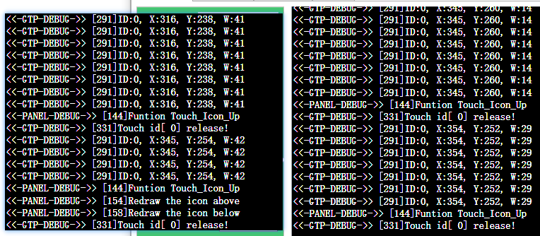  
通过调试信息可以看到虽然触摸屏调用了重绘函数，但是在判断释放区域的时候出了问题，明明是在图标范围内，但是没有进入if。再次回看这个触摸回调函数，是当触摸屏有触摸的时候调用该回调函数，回调函数判断触点是否在图标的区域范围之内，然后执行动作。  
灵光一闪：有可能是图标结构体**初始化不成功**！导致判断图标区域的时候没有符合的值，所以进不到if中去。
解决方法：打印调试日志，看看有没有初始化成功；是否因为第一次显示图标的时候加了delay的原因没有初始化成功？

#### 放大后的字符锯齿严重
野火自带的字库最大只制作了16×24版本的，若要显示更大的字的话有两种方法：  
1. 重新制作大字号的字库  
2. 利用字模放大函数实现动态制作任意大小的字模  

我先尝试了第二种方法，利用野火编写的字符放大函数，将原有的16×24的字模放大成64×96的字体后，发现锯齿效果严重  
  
用第一种方法——重新制作字模的话效果应该会更好。

#### 硬错误的出现
当触摸原点位置一个图标的范围内时（图标大小为96×96，从原点算起触摸范围为(96, 96)），会出现硬错误（HardFault）  
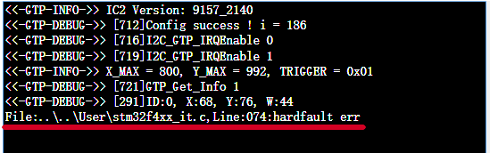  
似乎验证了前面的猜想：初始化不成功，导致坐标为0！当触摸回调出发的时候调用了空的、未知的绘制函数，导致出现了硬错误！  
为什么初始化不成功？会不会是调用放大函数的时候，声明的用于存储放大后字模的数组覆盖掉了初始化的数据？但又感觉不太可能。。。果然还是对内存的理解不够深入和透彻，才疏学浅。。。  

#### 烧录程序后一段时间内闪屏严重
**现象：**
- 每次烧录程序后的一段时间内出现闪频
- 一段时间过后闪屏现象消失（这一段时间内无任何操作）
- 不闪屏之后按复位键，重启后不闪屏
- 不闪屏之后断电源，重新上电后不闪屏

**分析：**  
闪屏现象据手册来讲一般是像素时钟频率设置过高，导致LTDC输出的帧像素数据的频率跟不上LCD刷新显示的频率，当LCD准备显示下一帧而读取引脚准备接收帧像素数据的时候，LTDC因为跟不上LCD频率而没有输出帧像素数据，导致LCD读到的是空值！所以屏幕会先暗下去一会儿，当下一次LCD下一次读取帧像素数据的时候LTDC跟上了，原先暗下去一会儿的地方继续显示图标，两种情况来回交替导致出现“闪屏”的现象。  
而至于为什么屏幕的其他地方没有明显的闪屏现象，只有图标的部分闪屏明显，我猜是因为其他地方显示的是白色，而背光灯就是白色的，当没有像素数据输入的时候就显示背光的颜色，所以我们看起来其他地方没有闪屏（一直是白色）实际上是白色像素-白色背光灯的来回交替，其他地方也是在闪屏的，只是错觉导致我以为没有闪屏而已。图标部分因为本来就是暗颜色的，暗颜色和白色背光交替就产生了我们看到的闪屏现象。  
对于为什么一段时间后就稳定的情况至今无解。一开始我以为是液晶屏的液晶需要一段时间的持续电压让它保持反射特定方向的光，后来觉得应该不是，因为在闪屏期间操作图标它是可以迅速切换开关状态图标的，只不过依然在闪屏而已。如果是因为需要持续电压的话应该根本不会迅速切换开关状态图标才对。所以我百思不得其解。

## 开发日志 2019/10/03
### LCD显示质量的提高
之前emwin版本的室内控制面板的**整体色调偏白**，我以为是LCD屏幕性能限制的原因。后来我把同样的图标用LTDC显示出来，发现LCD上显示的图标并不那么偏白，很接近电脑显示的颜色。说明并不是LCD本身性能的限制，而是软件的问题。  
猜测了一下可能的原因，大概是因为LCD Layer 1 和 Layer 2 的混合没有设置好，导致第二层（前景层）设置成了微透明的白色，导致经过层混合之后整体画面**偏白**；另一种可能是位图转换工具BmpCvt转换的`RLE编码`的图标图片数组在转换的时候出现偏差，导致显示的时候整体偏白。

### 触摸失效测试
对之前所猜测的图标结构体初始化不成功的问题做进一步测试。  
这是所添加的测试代码：
```
 for (i = 0; i < ICON_NUM; i++){

    PANEL_DEBUG("icon no = %d, x = %d, y = %d",i,icon[i].start_x,icon[i].start_y);
        
    if (触笔在图标区域释放){
       ...
    }
 }
```
这里主要是看看触摸屏在调用图标绘制函数时各个图标的坐标是否正常。  
用正常状态（显示字符语句放在图标结构体初始化之前）作为测试对照组，其不同状态下的输出语句如下：
- 触摸一号图标：  
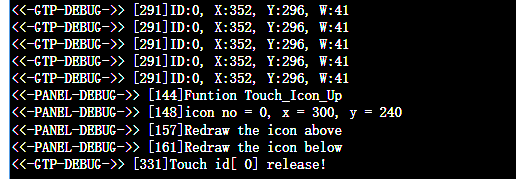  
- 触摸四号图标：  
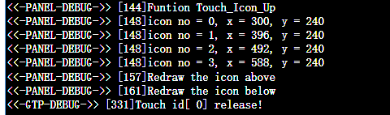  
- 触摸原点范围内的图标：  
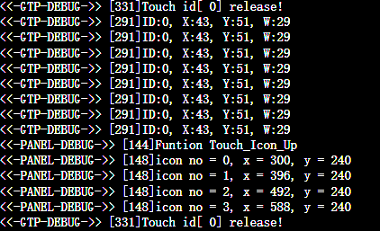  

接下来是触摸失灵的测试实验组，其不同状态下的输出语句如下：
- 触摸一号图标：  
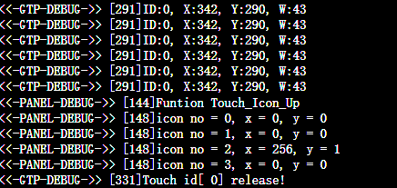
- 触摸原点范围内的图标：  
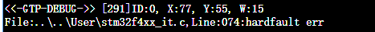  

从触摸一号图标的输出语句中可以看出，图标的坐标异常。说明跟预想的一样，初始化不成功。  
但是实际上，图标在LCD上显示的位置还是跟**预期的一样** ，并没有移动到原点。说明最开始的时候，图标结构体是初始化成功的，成功地被写入到显存相应的位置。但是在调用显示字符串语句之后，原有的图标结构体被改写了，图标的坐标异常，触摸回调函数判断不成功，无法重绘按钮，导致出现了“触摸失灵”的现象。  

疑问：是否因为放大显示字模函数中的某些语句导致结构体被重写？如果不用放大函数直接用原有的16×24字模显示会不会出现这种情况？  

### 字模显示
利用正常的字符串显示函数触摸屏反应正常。 
测试代码如下：   
```
  LCD_DisplayStringLineEx(0,0,64,96,"28%",0);

  Touch_Icon_Init();

  for (i = 0; i < ICON_NUM; i++)
  {
   /* 描绘图标 */
  }
  LCD_SetFont(&Font16x24);
  LCD_DisplayStringLine(LCD_LINE_7,"29");
  
```

显示结果如下：  
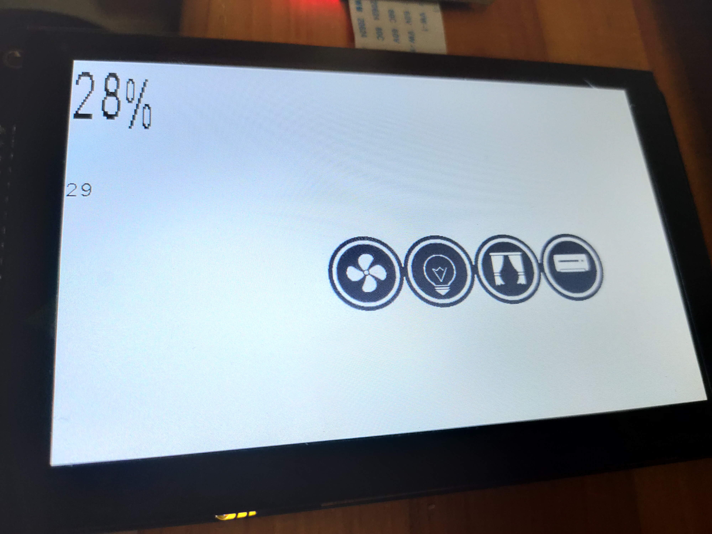  

触摸屏串口信息如下：  
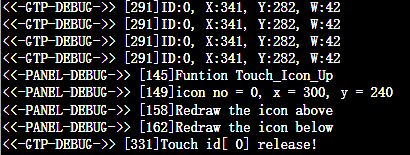  

触摸反应正常。没有去细究具体问题在哪个地方，开始着手大字号字模的制作。

## 开发日志 2019/10/04 

### 字模软件的使用

#### 1.字体的选择  
> 注意：在选择中文字体的时候要注意数字、字母和符号的**宽度**。  
因为中文字是**两个字符**宽的，而英文是**一个字符**宽的。当用某一些中文字体显示数字、字母和符号的时候有可能会出现显示不全的情况。如图所示：  

中文字体“方正兰亭特黑简体”字模显示结果：  
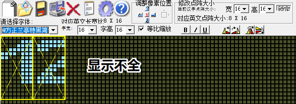  

英文字体字模显示结果：  
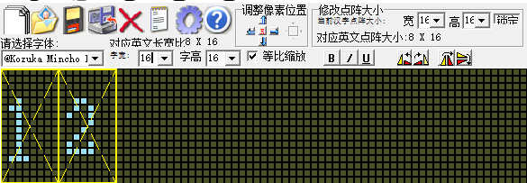  

可以注意到，中文字体的宽高比为***1：1*** ，而英文字体的宽高比为***1：2*** 。而对于常用的ASCII字符而言，1：2的宽高比完全足够了。  
对于我们目前的项目需求而言，我们的字模需要满足以下要求：  
- 相对面板来说要足够大
- 清晰易读
- 只用到数字和一些表示单位的字母、符号

所以我们选择的字体要**够粗**，这样别人在离得比较远的时候才能清楚地看见面板上的字；没有用到中文字符，所以直接选择***1：2***的宽高比即可。  

#### 2.设置所需要的字号
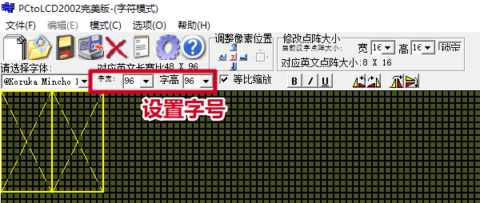  
> 注意：设置完了之后要`修改点阵大小`！！  

生成的字库数组是按照点阵的宽高来生成的，只会生成黄色方框内的字模内容。  
我们可以看到明明设置好了字的宽高，但是黄色方框内却没有内容。原因就是没有根据字的宽高修改点阵的大小（即黄方框的大小），导致16×16的点阵显示不出96×96的字。  

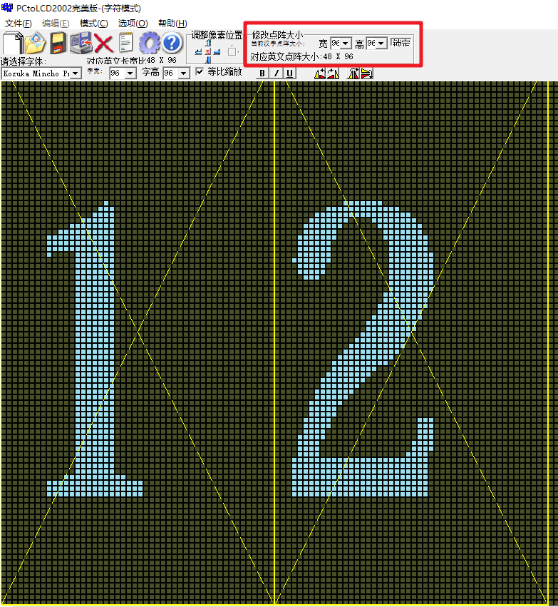  

可以看到，将点阵修改为与字体宽高一致后字符可以完全显示。  

#### 3.设置输出配置  
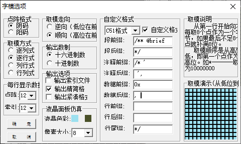  

字模选项中的参数可以查看野火资料中*A盘（资料盘）\4-开发软件\字模软件\PCtoLCD\字库工具*下的**readme2002.txt** ，里面有较为详细的介绍。  
其中，值得注意的是`每行显示数据`中`点阵`的设置。这里面的点阵数量是指生成的txt文件中每行十六进制数的个数，跟数组的排版有关。下图为点阵数量为12时生成的字模数据：  
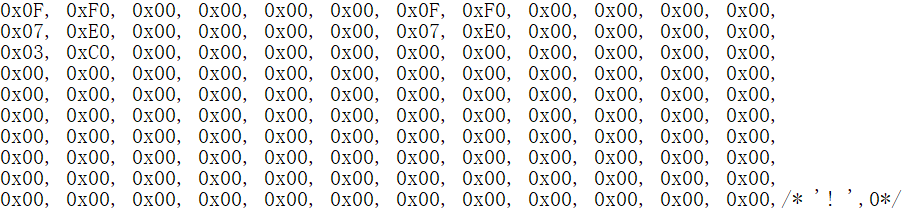  
> 以一行48个像素为例，一位表示一个像素，一个十六进制数表示2 × 8 个像素点，所以六个十进制数表示字模的一行。我们设置的是输出文件一行12个十六进制数，所以输出文件中的一行表示两行字模。  
> 注意：我们最后是将文件输出文件的内容存进`一维数组`中，所以无论怎么设置输出文件一行的个数都对程序无影响！主要是跟排版有关。要理清思路。

#### 4.生成字库
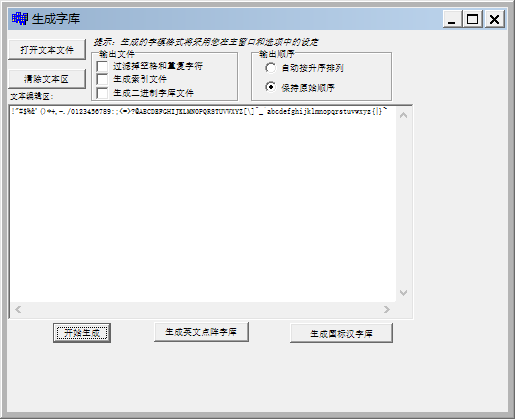  

点击打开文本文件即可载入批量的文本，其中目录下的**ascllCODE.TXT** 为32至126位的ASCII码文件。  
在输出文件中**取消勾选**“生成二进制字库文件”，然后点击**开始生成**，即可生成txt格式的十六进制文件了。  


